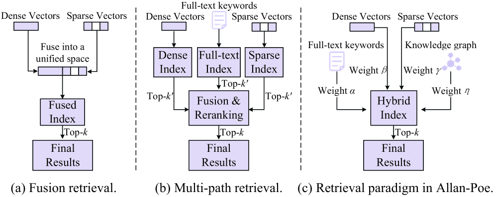

##  MSTM/目标模态搜索

- MSTM 不是一个单一的相似性搜索问题。它是一个检索机制的混合体。

## Allan-Poe: All-in-one Graph-based Indexing for Hybrid Search on GPUs
- paper info
    - link: https://arxiv.org/html/2511.00855v1
    - Author: Zhonggen Li, Zhejiang University

- Key Point
    - Hybrid Search 已成为一种很有前景的范式，可以克服单路径检索的局限性，提高推荐、信息检索和检索增强生成等应用的准确性。
    - Allan-Poe构建了一个统一的基于图的索引，该索引在一个统一的结构中灵活地集成了四种检索路径: 稠密向量、稀疏向量、全文和知识图谱

- Problem:
    - Fusion Retrieval: 效率/精度/可拓展性差
    - Multi-path Retrieval: 广泛使用，但是独立的索引存储 => 开销大，检索效率低 
    - 将多种多路径索引统一到一个单一的、一体化的混合索引中

    

- Challenges
    - 如何设计统一且灵活的基于图的混合索引？ 
    - 如何实现混合索引的搞笑构建和有效搜索？

## MINT: Multi-Vector Search Index Tuning
- Paper Info
    - link: https://arxiv.org/html/2504.20018v1
    - author: Jiongli Zhu (UCSD)

- Key Point
    - 多向量搜索在当今多模态和多特征场景下变得尤为重要
    - 在多向量数据库中，索引的选择会对性能产生显著影响。尽管关系数据库的索引调优已经得到了广泛的研究，但多向量搜索的索引调优仍然不甚明了且充满挑战。本文定义了多向量搜索的索引调优问题，并提出了一个相应的框架来解决该问题。具体而言，给定一个多向量搜索工作负载，我们开发了能够找到延迟最小且满足存储和召回约束的索引的算法。
